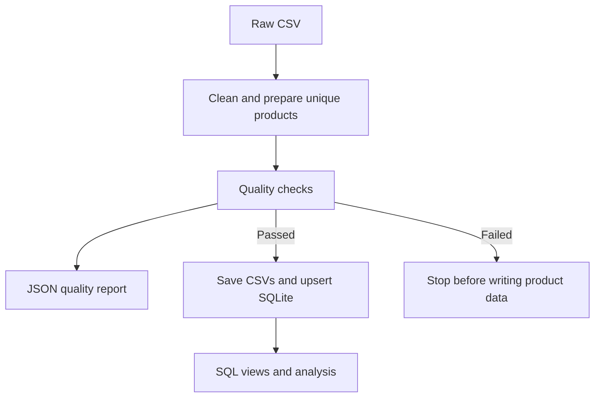

# Product Data Platform

[](https://github.com/Abdulwahab-Alnassar/product-data-platform/actions/workflows/tests.yml)

A personal data engineering and AI project that cleans product data,
validates quality, upserts products into SQLite, and runs SQL analytics.

## Project Goal

Build an end-to-end product data platform, starting with batch processing
and gradually extending to real-time pipelines and AI-powered product Q&A.
PostgreSQL, Docker, hybrid search, and RAG are future milestones.

## Current Progress

- [x] Project structure and dataset exploration
- [x] Data cleaning and relational storage
- [x] Basic SQL analysis and automated testing
- [x] Unified ETL pipeline (week 2, day 1)
- [x] Logging and failure reporting (day 2)
- [x] Data quality reports (day 3)
- [x] Transactional SQLite upsert (day 4)
- [x] SQL views and window functions (day 5)
- [x] GitHub Actions workflow (day 6)
- [x] Week 2 documentation and reading guide (day 7)

Read the [Arabic week 2 guide](docs/week2-guide-ar.md) for a day-by-day
explanation and the recommended order for reading the code.

## Technology Stack

Python 3.12, Pandas, SQLite, SQL, Pytest, Git, and GitHub Actions.
PostgreSQL is planned for the next stage.

## Setup and Run

From the repository root, activate your virtual environment and install:

```bash
python -m pip install -r requirements.txt
```

Place the original Amazon Sales Dataset at `data/raw/amazon.csv`, then run:

```bash
python -m src.pipeline
```

The full dataset stays local and is not included in GitHub. A missing
input file fails explicitly; the program never silently substitutes a sample.

For a demonstration using the included public sample in a separate directory:

```bash
python -m src.pipeline --input data/sample/amazon_sample.csv --output-dir data/processed/demo
python -m src.analyze_data --database data/processed/demo/products.db
```

## Pipeline Architecture



Logging records stage starts, counts, total duration, and exceptions.
The quality report describes the prepared incoming batch. It also checks
that the cleaned intermediate columns contain no user ID/name columns.

## Outputs

| Output | Default path |
| --- | --- |
| Cleaned intermediate rows | `data/processed/cleaned_products.csv` |
| First 100 cleaned rows | `data/sample/cleaned_products_sample.csv` |
| Product database | `data/processed/products.db` |
| Latest quality report | `data/processed/quality_report.json` |
| Rotating execution log | `logs/pipeline.log` |

With `--output-dir`, all five outputs go inside that directory. The default
sample path is tracked by Git, so running the full pipeline may change that
CSV. Raw data, processed outputs, and logs are ignored.

The cleaned CSV is an intermediate result and can contain multiple rows
for the same product. Before loading, the pipeline keeps the row with
the highest `rating_count` per ID; ties retain the first input row.
The summary distinguishes cleaned rows, removed duplicate IDs,
`batch_rows` (verified incoming products), and `database_rows` (all stored
products). With partial batches, these last two numbers can differ.

## Quality Policy

Blocking checks cover required columns, nonempty data, nonblank IDs/names,
unique product IDs, finite/nonnegative numeric values, ratings in 0–5,
discounts in 0–100, integer rating counts, price ordering, and absence of
`user_id`/`user_name` columns.

Missing numeric values are warnings, not invented zeros. Cleaning can
convert malformed or out-of-range source values into missing values, so
the report reflects the cleaned batch, not all original source defects.
It includes counts rather than product/review contents.

Missing input, an empty input, missing schema columns, or no usable products
can fail before the quality stage, in which case consult the current log;
a report left from an earlier run is not a report for the failed run.
A failed quality check writes a diagnostic JSON report and stops before
overwriting product CSVs or loading the database.

## Upsert Semantics

`product_id` is the key. A new ID is inserted; an existing ID is updated.
Rows absent from an incoming batch remain stored. Incoming NULL values
replace previous values too. Input order is authoritative; there is no
timestamp-based conflict resolution yet.

All product writes in a batch share a transaction. The loader checks
every stored incoming value against a temporary batch table before commit.
A failed insert or verification rolls back the batch's product changes.
Schema/view initialization and CSV/report writes are separate operations,
not a single transaction across files and SQLite. Concurrent runs against
the same output directory are not supported.

## SQL Analysis

After a successful pipeline run, execute:

```bash
python -m src.analyze_data
```

- `sql/analysis_queries.sql`: the original five queries.
- `sql/views.sql`: `product_analytics` and `category_product_rankings`.
- `sql/advanced_queries.sql`: rating groups, category ranks, average savings,
  missing values, and inconsistent stored prices.

Prices and savings remain in **Indian rupees (INR)**, the source currency.
Ranks use the main category (the first part of the pipe-delimited taxonomy).
`DENSE_RANK` preserves ties, so the top three ranks may contain more than
three products. Unrated products have a NULL rank. Analysis opens the
database read-only; run the updated pipeline once to create the views.

The standalone `python src/clean_data.py` and
`python src/load_to_db.py` commands remain available, but use the unified
pipeline for logging and the full quality gate.

## Tests and Continuous Integration

```bash
python -m pytest -v
```

Tests use synthetic data and temporary databases. They cover cleaning,
quality failures, pipeline orchestration, partial upserts, rollback,
SQL rankings, and logging. GitHub Actions runs on pushes and pull requests
on both Ubuntu and Windows using Python 3.12, then runs the public sample
through the pipeline and saved SQL analysis. It does not use your full
local dataset or upload raw data or generated databases.

## Dataset and Data Handling

This project uses the public Amazon Sales Dataset available on Kaggle.
Cleaning removes the `user_id` and `user_name` columns.
Free-text reviews are not automatically anonymized.

## Author

Abdulwahab Alnassar  
Computer Science Student at King Saud University
