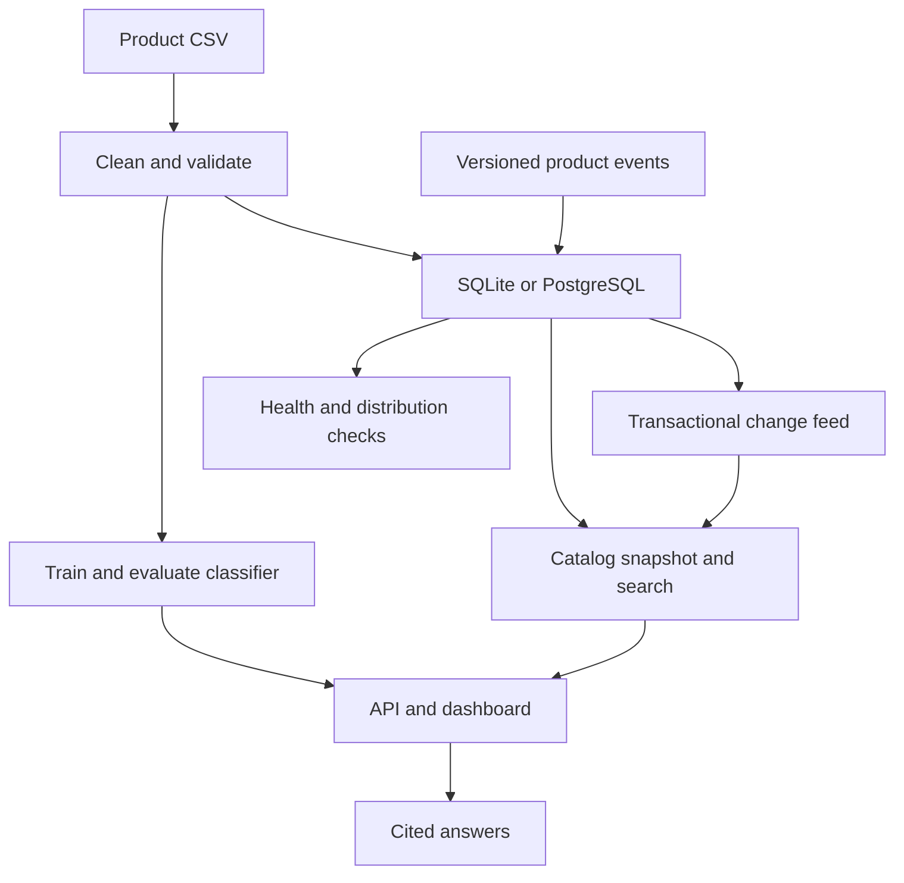

# Product Data Platform

[](https://github.com/Abdulwahab-Alnassar/product-data-platform/actions/workflows/tests.yml)

A local platform covering the path from a messy product CSV to validated storage,
category prediction, search, cited answers, incremental updates, and operational checks.

The demo runs on the included 100-product sample without API keys, paid services,
or downloaded language models. It supports SQLite and PostgreSQL. Prices stay in INR.

## Completed milestones

| Stage | Working feature | Main files |
| --- | --- | --- |
| Month 1: data | Cleaning, quality gates, transactional upserts, SQL analytics, Docker | `src/pipeline.py`, `sql/` |
| Month 2: ML | TF-IDF + logistic regression, baseline, train/validation/test splits, JSON artifact | `src/train_model.py`, `src/predict.py` |
| Month 3: serving | FastAPI, validation, guarded writes, predictions and health | `src/api.py` |
| Month 4: retrieval | Lexical + latent-vector search, exact IDs, cited facts, optional local RAG | `src/search.py`, `src/qa.py` |
| Month 5: updates | Versioned events, retries, deletion tombstones, transactional change feed | `src/events.py`, `sql/changes.sql` |
| Month 6: operations | Monitoring, metrics, backup/restore checks, CI and documentation | `src/monitor.py`, `src/backup.py`, `docs/` |

Months 3–6 are the scope chosen to complete this repository, not a reconstruction
of an unavailable earlier study plan. See the [completion map](docs/completion-map.md).

## Windows quick start

Use Python 3.12 and PowerShell in the repository root. Keep your existing virtual
environment if you already have one.

```powershell
git pull --ff-only origin main
python -m venv .venv
.\.venv\Scripts\python.exe -m pip install -r requirements.lock
.\.venv\Scripts\python.exe -m src.demo
$env:SQLITE_PATH = 'data/processed/demo/products.db'
.\.venv\Scripts\python.exe -m streamlit run dashboard.py
```

Open http://localhost:8501. The dashboard includes analytics, prediction, hybrid
search, product Q&A, and data health. Stop it with Ctrl+C. Demo outputs are isolated
from your original full dataset. On Linux/macOS, use `.venv/bin/python` and
`export SQLITE_PATH=data/processed/demo/products.db` instead.

Start the API in a second terminal:

```powershell
$env:SQLITE_PATH = 'data/processed/demo/products.db'
.\.venv\Scripts\python.exe -m uvicorn src.api:app --host 127.0.0.1 --port 8000 --no-access-log
```

Open http://localhost:8000/docs. `/health` checks the process; `/ready` checks
database initialization. Prediction requires a trained model.

## PostgreSQL and Docker

Start Docker Desktop with Linux containers. Copy `.env.example` to `.env`
only if that file does not already exist, then set a strong nonempty
`POSTGRES_PASSWORD`. Leave `PLATFORM_API_KEY` empty to disable HTTP writes.

```powershell
docker compose up --build -d --wait dashboard api
docker compose logs pipeline
docker compose exec -T api python -m src.smoke
```

The database starts first, the initialization job loads the sample and trains
the model, then the API and dashboard start. The job exiting with code 0 is normal.
The published ports bind to 127.0.0.1; PostgreSQL has no host port. Named volumes
preserve the database, models, and outputs. `docker compose down` keeps those
volumes; adding `-v` deletes them. See the [operations guide](docs/operations.md).

## Architecture



The classifier uses product names only. Duplicate IDs and identical titles are
removed before splitting; rare categories are reported and excluded. The
vectorizer learns from training data only. Validation selects between two
regularization values, then the test set evaluates the selected artifact.

The demo has only two categories and a small test set. Its scores are not evidence
of accuracy on a larger or different catalog. Unknown vocabulary causes abstention,
and probabilities are not calibrated confidence. Read the [model card](docs/model-card.md).

Search combines word/bigram TF-IDF similarity (70%) and SVD-derived latent-vector
similarity (30%). Exact product codes take priority. These vectors come from the
catalog, not a pretrained language model. The index refreshes on the next request
after a committed revision change.

Default Q&A returns catalog facts with product IDs and treats missing stock as
unknown. Optional Ollama generation uses retrieved records as context and rejects
unknown citations. Valid citations do not prove every generated statement is
correct. See [retrieval and RAG](docs/retrieval.md).

## Incremental updates

```powershell
$env:SQLITE_PATH = 'data/processed/demo/products.db'
.\.venv\Scripts\python.exe -m src.events examples/events.jsonl
```

This adds a labeled synthetic lantern, then changes its price and stock. Search
for `DEMO-LANTERN` in the dashboard. Replaying the file is safe. Older versions
are ignored; reused IDs with changed payloads are rejected. Deletion tombstones
prevent older events from resurrecting products.

Upsert events replace the supported product fields; omitted fields become NULL.
Omitted inventory stays unchanged, while explicit null stock means unknown. The
JSONL command commits each line separately. Fix a failed line and replay the file.

Batch imports are authoritative for incoming IDs and do not obey event versions:
load the baseline first, then use events for ongoing changes. Database triggers
capture row changes in the same transaction. This is a trigger-based change feed,
not Kafka/Debezium WAL streaming. Consumers poll `/changes?after=0` and persist the
returned cursor. There is no upstream live Amazon feed or latency SLA.

## Tests and reproducibility

```powershell
.\.venv\Scripts\python.exe -m pytest -v
.\.venv\Scripts\python.exe -m src.evaluate_search
.\.venv\Scripts\python.exe -m src.monitor
```

PostgreSQL tests skip locally unless `TEST_DATABASE_URL` identifies an explicit
disposable database. CI runs them against PostgreSQL 17 in isolated schemas.
Other jobs cover Windows, Linux, Docker, API smoke, and a real PostgreSQL restore.
See [verification](docs/verification.md).

`requirements.lock` records the resolved Python 3.12 environment used by CI and
Docker; `requirements.txt` contains development ranges. Generated databases,
models, raw inputs, reports, logs, and secrets are ignored by Git.
`evaluation/demo/` contains a small evaluation snapshot for review.

## Reading guide

Read `src/pipeline.py`, `src/train_model.py`, `src/predict.py`, `src/catalog.py`,
`src/events.py`, `src/search.py`, `src/qa.py`, and `src/api.py` in that order.
Comments explain design decisions; the tests show normal behavior and failure cases.

- [Arabic project guide](docs/project-guide-ar.md)
- [Architecture and contracts](docs/architecture.md)
- [Operations and troubleshooting](docs/operations.md)
- [Security and privacy](SECURITY.md)
- [Original week 2 guide](docs/week2-guide-ar.md)
- [Original weeks 3–4 guide](docs/week3-4-guide-ar.md)

## Data and boundaries

Source: [Amazon Sales Dataset](https://www.kaggle.com/datasets/karkavelrajaj/amazon-sales-dataset).
The public sample omits customer identifiers and blanks review fields. This does
not rewrite old Git history. Search and API responses exclude reviews and mask
obvious email addresses and phone numbers; this is not complete anonymization.

This is a complete local portfolio application, not a publicly deployed production
service. Reader authentication, per-user authorization, distributed indexing,
managed secrets, retention policies, and automatic model approval are outside its
current operating boundary. The in-memory catalog is capped at 50,000 products.
Do not expose the local demo directly to the internet.

## Author

Abdulwahab Alnassar — Computer Science, King Saud University
